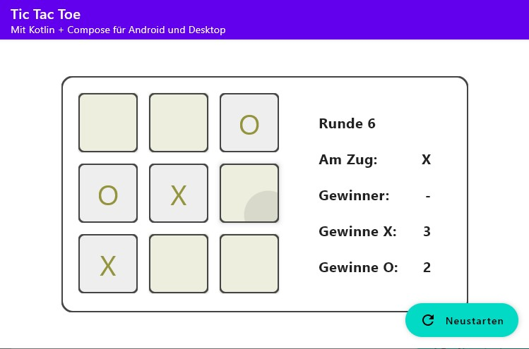

# tictactoe

Tic Tac Toe - Kotlin/Multiplatform + Compose (Desktop &amp; Android)

## Features
- ansprechen von Android und Desktop (Windows/JVM, macOS/JVM, Linux/JVM) Targets über [eine Codebase](./common/src/commonMain/kotlin/com/toleno/common)
- dennoch mögliche Platform-spezifische Implementierungen (s. z.B. [expect val platformName](./common/src/commonMain/kotlin/com/toleno/common/platform.kt) und [actual val platformName](./common/src/desktopMain/kotlin/com/toleno/common/platform.kt))
- einfache, wiederverwendbare Komponenten (Composables) (z.B. [Anzeige](./common/src/commonMain/kotlin/com/toleno/common/Anzeige.kt) zur Darstellung von Texten neben dem Spielfeld)
- MVVM-Model benötigt keinen Controller
    - State wird an Kind-Komponenten gegeben
    - Aktionen werden vom View ausgelöst
    - Aktionen können den State verändern
    - *Veränderter* State wird an Kind-Komponenten gegeben
    
## Installation
Es wird empfohlen, die Intellij run configurations zu benutzen.

**Desktop**
- `./gradlew run` - entwickeln
- `./gradlew package` - native Archive in `build/compose/binaries` bauen

**Android**
- `./gradlew installDebug` - Android-App auf Android-Gerät installieren (echt oder Emulator)